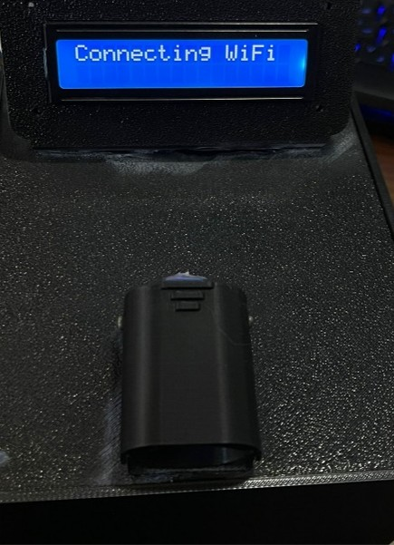
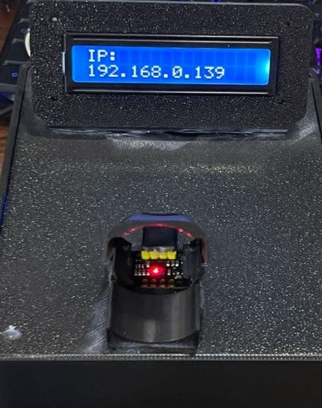
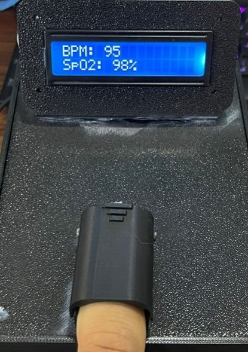
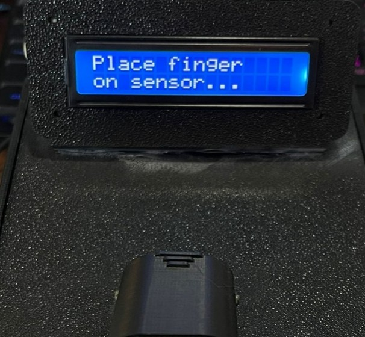
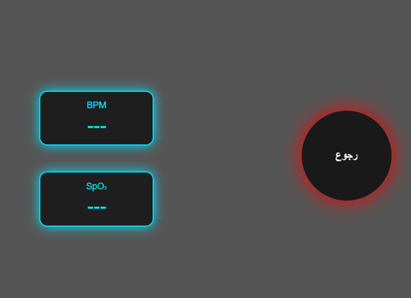
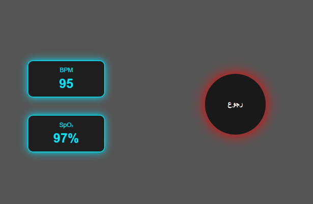

# IoT-Based Pulse Oximeter & Real-Time Vital Signs Monitor 🩺📶

[](https://orcid.org/0009-0001-9884-8397)
[](https://www.espressif.com/)
[](https://www.maximintegrated.com/)
[](LICENSE)

## 📌 Overview
This repository contains the full embedded firmware, hardware configuration, and web interface for an **IoT-enabled non-invasive Vital Signs Monitoring System**. The system continuously measures **Heart Rate (BPM)** and **Peripheral Blood Oxygen Saturation ($SpO_2$)** using Photoplethysmography (PPG) principles, processes the signals in real time via an ESP8266 NodeMCU microcontroller, and hosts a web-based HUD interface for remote clinical visualization.

Developed and documented by **MSc. Ibrahim Khalil Kamil** as part of academic research and biomedical instrumentation engineering projects.

---

## 🖼️ System Hardware & User Interface Gallery

| Hardware Setup | Vital Signs Reading (BPM & SpO2) | Standby Mode Prompt |
| :---: | :---: | :---: |
|  |  |  |

| Wi-Fi Connection & IP | Web HUD Interface | Finger Placement & Sensor Alignment |
| :---: | :---: | :---: |
|  |  |  |

---

## 🖨️ Custom 3D-Printed Enclosure & Finger Clip
The physical device features a custom **3D-printed black enclosure and ergonomic finger clip** designed to secure the optical sensor, prevent ambient light interference, and ensure stable skin-sensor contact.

- **CAD Models:** Available in the [`3D_Models/`](./3D_Models) directory.
- **Enclosure Design:** Houses the ESP8266 NodeMCU, 16x2 LCD display, active buzzer, and MAX30102 sensor cleanly.

---

## 🛠️ Key Technical Features
- **Photoplethysmographic Sensing:** Employs the MAX30102/MAX30105 biophotometric optical sensor utilizing Red (660nm) and Infrared (880nm) LEDs with a high-sensitivity photodetector.
- **Embedded Web Server:** Embedded TCP/IP stack running on NodeMCU ESP8266 hosting a responsive, dynamic web HUD (HTML5/CSS3/JavaScript) updating via JSON APIs.
- **Dual Display Interface:** Local display via $16 \times 2$ Character LCD (I2C interface at `0x27`) and remote browser monitoring.
- **Audible Signal Alerts:** Active Buzzer indication upon stabilization of valid physiological readings.
- **I2C Bus Protocol:** High-speed I2C communication (`400 kHz`) between sensor, LCD display, and microcontroller.

---

## 🔌 Hardware Architecture & Component List

| Component | Specifications / Role | Connection Pin (ESP8266) |
| :--- | :--- | :--- |
| **ESP8266 NodeMCU** | Main Microcontroller & Wi-Fi Gateway | Core Unit |
| **MAX30102 / MAX30105** | Biophotometric Pulse & $SpO_2$ Sensor | SDA -> GPIO4 (D2), SCL -> GPIO5 (D1) |
| **LCD 16x2 (I2C Adapter)** | Local Real-Time Display | SDA -> GPIO4 (D2), SCL -> GPIO5 (D1) |
| **Active Buzzer** | Audio Completion Notification | Positive -> GPIO14 (D5) |
| **3D Printed Enclosure** | Component Protection & Finger Alignment | Physical Case |

---

## 📐 Mathematical Principle of Operation

The system leverages the **Beer-Lambert Law** to measure optical absorption variations across cardiac cycles:

$$I = I_0 \cdot e^{-\epsilon \cdot c \cdot l}$$

Where:
- $I_0$: Incident light intensity.
- $\epsilon$: Extinction coefficient of hemoglobin.
- $c$: Concentration of oxyhemoglobin / deoxyhemoglobin.
- $l$: Optical path length through peripheral tissues.

### Heart Rate Calculation
Beat intervals ($\Delta T$) are detected from successive AC peaks in the Infrared optical channel:
$$\text{BPM} = \frac{60}{\Delta T_{\text{seconds}}}$$

### $SpO_2$ Determination
Computed via the ratio-of-ratios ($R$) of normalized AC/DC components across Red and IR spectra:
$$R = \frac{(AC_{\text{Red}} / DC_{\text{Red}})}{(AC_{\text{IR}} / DC_{\text{IR}})}$$
$$SpO_2 = A - B \cdot R$$

---

## 💻 Embedded Software Structure (`.ino`)

The firmware is developed using the **Arduino Framework for ESP8266** and integrates:
1. **`ESP8266WiFi.h` & `ESP8266WebServer.h`:** Manages station connection and serves web interface endpoints (`/`, `/measure`, `/data`).
2. **`Wire.h` & `LiquidCrystal_I2C.h`:** Controls character LCD rendering over I2C.
3. **`MAX30105.h` & `heartRate.h`:** Manages sensor LED pulse amplitudes (`0x1F`) and peak-detection algorithms.

---

## 📊 Experimental Results & Validation

Tested under controlled physiological conditions and validated against commercial pulse oximeters:

| Sample No. | System BPM | Reference BPM | System $SpO_2$ (%) | Reference $SpO_2$ (%) |
| :---: | :---: | :---: | :---: | :---: |
| 1 | 95 | 97 | 97% | 98% |
| 2 | 88 | 90 | 96% | 97% |
| 3 | 102 | 100 | 98% | 99% |
| 4 | 76 | 78 | 97% | 98% |

---

## 🏷️ Citation & Academic Profile
If you use or reference this project repository in your academic publications or engineering designs, please cite as:

```bibtex
@misc{Kamil2026VitalSignsMonitor,
  author = {Ibrahim Khalil Kamil},
  title = {IoT-Based Pulse Oximeter & Real-Time Vital Signs Monitor},
  year = {2026},
  publisher = {GitHub},
  journal = {GitHub Repository},
  howpublished = {\url{[https://github.com/ibrahimkhalil975](https://github.com/ibrahimkhalil975)}}
}
